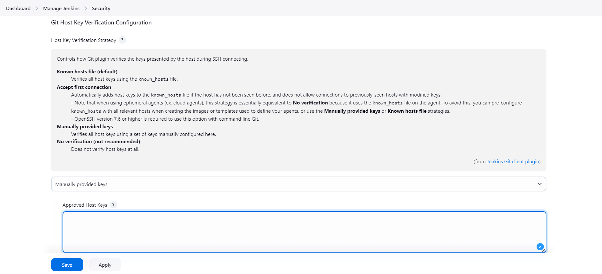

# Configurando o ambiente e conectando máquina virtual

## Máquina virtual com o vagrant

### Subindo o ambiente virtualizado

```sh
vagrant plugin install vagrant-disksize
vagrant up
vagrant ssh
ps -ef | grep -i mysql # Verificando se o MySQL esta rodando
mysql -u devops -p # Senha mestre; show databases
mysql -u devops_dev -p # Senha mestre; show databases
# Instalando o Jenkins
sudo ./jenkins.sh
# Acessar:  192.168.33.10:8080
sudo cat /var/lib/jenkins/secrets/initialAdminPassword
vagrant reload
```

## Instalar scripts e mover chave ssh para a a VM

```sh
#na maquina local
Get-Content \.ssh\id_ed25519.pub
vagrant ssh 
echo "conteúdo_da_chave_pública" >> ~/.ssh/authorized_keys
chmod 600 ~/.ssh/authorized_keys
chmod 700 ~/.ssh
scp -i ./id_ed25519 ./id_ed25519 vagrant@192.168.33.10:/home/vagrant/.ssh/
```
>>> OBs: este trecho configurar em perder o acesso pelo comando 
>>> ``` vagrant ssh ```
>>> ``` ssh vagrant@host-da-maquina #somente assim funciona ```


## Configuração de verificação de chave de host Git

```sh
 ssh-keygen -F github.com | Select-String "ssh-ed25519" # powershell
 ssh-keygen -F github.com | grep "ssh-ed25519"  #bash
```

### Acesse o url http://192.168.33.10:8080/manage/ 

 #### add a chave com o comando abaixo como na imagen




